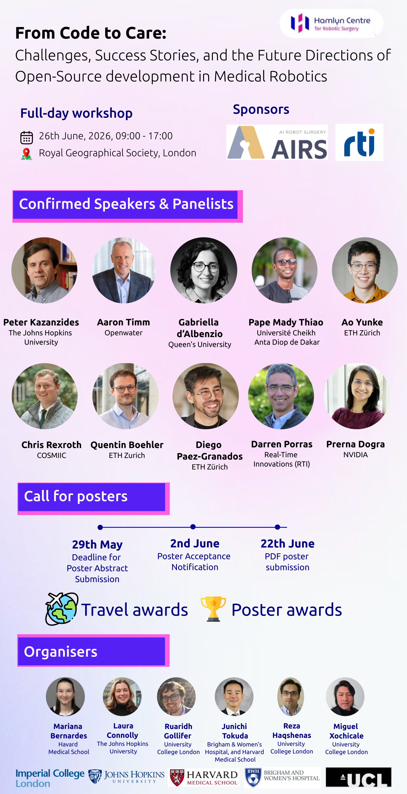

# Promotion kits

## Message template 

✨ Join us for a full-day workshop

From Code to Care: Challenges, Success Stories, and Future Directions of Open-Source Medical Robotics

📅 26 June 2026 | 📍 London | 🏛️ Hamlyn Symposium

We are excited to welcome you to a unique event bringing together leading voices from industry and academia in medical and surgical robotics. Expect a day of insightful talks, dynamic panel discussions, and valuable networking with researchers, engineers, and clinicians shaping the future of the field.

This workshop is a great opportunity to:

* Explore the latest advances in open-source medical robotics

* Hear real-world success stories and ongoing challenges

* Connect with a growing international community

* Spark collaborations across academia and industry

📢 Call for Posters (Now Open!)

Submit your abstract by 29 May 2026 for a chance to:

* Present your work to an engaged, interdisciplinary audience

* Build new collaborations

* Receive 🏆 travel awards and best poster prizes

🎟️ Registration Open

Tickets are available, including student discounts.

Registration closes 11:59 pm BST, Sunday 14 June 2026.

👉 Register & submit here:

https://lnkd.in/eAGhrbeJ

🤝 Join the community

We are building a vibrant open-source community in surgical/medical robotics. Stay connected:

* GitHub: [OSS in Surgical Robotics GitHub](https://lnkd.in/eiNnMdB7)

* Workshop site: [Project Website](https://lnkd.in/eKUbxnQg)

* Discord: [Join our Discord](https://lnkd.in/e42uJHEj)

* Recorded talks will also be shared on YouTube

🙏 Many thanks Hamlyn Centre for Robotic Surgery team for supporting this event and to our sponsors AIRS Inc and Real-Time Innovations (RTI) for their support. 

🚀 If other organisations are interested in sponsoring us to help bring talented researchers to the workshop, please feel free to reach out.

Let’s advance medical and surgical robotics together through open-source innovation.

#OpenSource #HealthTech #AI #Surgery #Collaboration #HamlynSymposium #HSM26 #MedicalRobotics #SurgicalRobotics

https://www.linkedin.com/posts/activity-7460385894550626304-kRFD

## Poster extension (re-positng/sharing)

📢 Exciting news! The abstract submission deadline for our full-day workshop, "From Code to Care: Challenges, Success Stories, and the Future Directions of Open-Source development in Medical Robotics", has been extended to 12 June 2026, 12:00 PM (UTC+0).

🎯 Don’t miss this unique opportunity to connect, collaborate, and innovate! Spaces are limited and going fast, so be sure to register by 15 June to secure your place.

⚠️ Please note: There will be no on-site registration, so book early to avoid disappointment.

👉 Sign up today:
https://www.hamlynsymposium.org/events/from-code-to-care-challenges-success-stories-and-the-future-directions-of-open-source-development-in-medical-robotics/

#HamlynSymposium #OpenSource #BiomedicalTech #SurgicalInnovation #AI #Collaboration #CallForPosters #LondonEvents #HSM26 #MedicalRobotics #SurgicalRobotics

## Social media message template with hashtags

🌟 Don’t miss “From Code to Care: Challenges, Success Stories, and the Future Directions of Open-Source development in Medical Robotics”
📅 26th June | 📍 London | 🏛️ Hamlyn Symposium 

This one-of-a-kind event brings together experts from industry, academia, and regulatory bodies to explore how open-source tools are shaping the future of healthcare. Expect inspiring talks, thought-provoking panel discussions, and plenty of opportunities to connect and collaborate.
Whether you're a developer, researcher, clinician, or just curious — come join the conversation. Let’s move healthcare forward, together.

#OpenSource #HealthTech #AI #Surgery #Collaboration #HamlynSymposium #HSM26 #Telesurgery #MedicalRobotics #SurgicalRobotics

## Promo kit images
Feel free to use this promo kits in your massages

